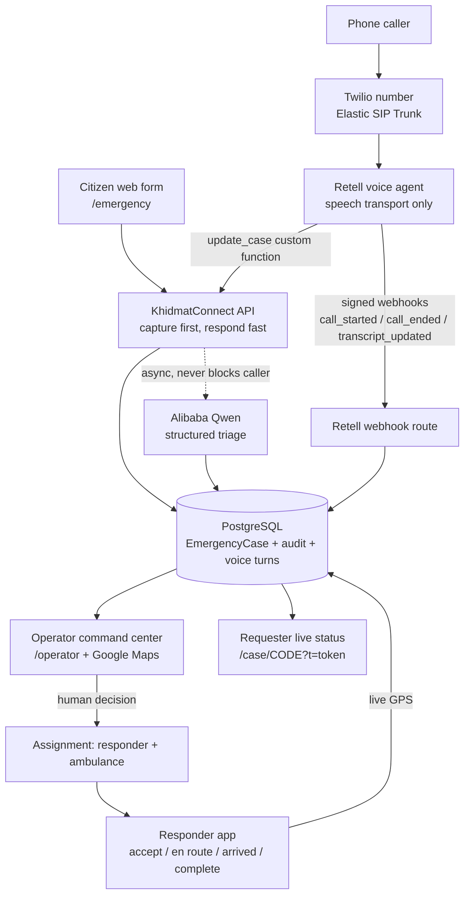

# KhidmatConnect AI

**AI-assisted humanitarian emergency intake, triage and coordination infrastructure for Pakistan - Urdu-first, phone-first, human-decides.**

Live: https://khidmatconnect.teqprotech.com (public, no login required to report an emergency)
Proven with a real phone call in production: case **KC-2026-000018** - a caller spoke Urdu, 8 transcript turns persisted, Qwen triaged it CRITICAL / RESCUE + MEDICAL, an operator saw it live, and the call completed with **no false dispatch claim**.

---

## Problem

Pakistan's emergencies - monsoon floods, urban fires, road-accident trauma, cardiac events, earthquake displacement - are reported through fragmented channels: 1122 hotlines that saturate during mass events, WhatsApp groups, NGO field numbers, and word of mouth. Three things break at the same time:

1. **Language.** Most people in distress speak Urdu or Roman Urdu, not English. Forms and IVR menus written in English lose them.
2. **Location.** "Gulshan Block 7, near the gali 3 mosque" is not a lat/lng. Half of all rescue delay is locating the caller.
3. **Coordination.** NGOs such as Alkhidmat run real ambulances, shelters, ration and water points - but intake, prioritisation, dispatch and family updates happen on paper and phone calls, so nobody has a shared status.

The result is not a lack of goodwill. It is a lack of **coordination infrastructure**.

## Solution

KhidmatConnect AI puts one authoritative case at the centre of that chaos, with three doors into it and one auditable lifecycle out of it:

- A **citizen reports** on a no-login web form (Urdu / English / mixed, RTL-aware) or, for an ultra-urgent emergency, simply **calls the hotline** and talks to a voice agent that asks for exactly what a coordinator needs - voice (Retell/Twilio) is an additional access path into the same authoritative case, not a separate product.
- The case is **created the moment the call connects - before any AI runs**. Facts are appended as the caller supplies them; the raw words are stored verbatim as the authoritative record.
- **Alibaba Cloud Model Studio (Qwen)** reads the raw text and returns structured decision-support: urgency, categories, key needs, special needs, what information is missing, and one good follow-up question.
- A **human operator** reviews, then assigns a **real responder and a real ambulance**. Availability is enforced, so a unit cannot be double-booked.
- The **responder** accepts, goes en route (live GPS breadcrumbs), arrives, completes.
- The **requester's family** watches the same status on a shareable link - no app, no account - updated by polling every 10 seconds.

AI never dispatches. A person always does.

## Key Features

| Area | What is actually built |
|---|---|
| Emergency web intake | `/emergency` - no login, Urdu/English/mixed, optional browser GPS, manual location fallback, returns a case code + 90-day hashed tracking token stored in the browser |
| Voice intake (Urdu/English/mixed) | Real phone call -> Retell conversational agent -> `update_case` custom function returning in well under a second; provisional case pre-created at `call_started` (capture-first) |
| Retell conversational voice | Inbound telephony via Twilio Elastic SIP Trunk; webhooks `call_started` / `call_ended` / `transcript_updated`, HMAC-signed and fail-closed |
| Twilio SIP telephony | Production number terminates onto Retell; the earlier Twilio record->ASR->TTS prototype remains as a legacy fallback path, untouched |
| Alibaba Qwen emergency triage | Structured JSON: summary, reasoning, urgency, categories, key/special needs, missing information, follow-up question, confidence, people affected - async, deduplicated by input fingerprint |
| Raw transcript persistence | Every utterance stored byte-exact with speaker role (`CALLER` / `AI`) and order preserved; cumulative webhook redelivery is idempotent |
| Operator command center | `/operator` live queue sorted by urgency/age, case detail with AI panel, audit timeline, notes, resource assignment, voice transcript panel with real turn count |
| Responder workflow | `/responder` assignment list, accept / en route / arrived / complete, live GPS POST, bilingual toasts, support request modal |
| Ambulance & resource assignment | Responder + ambulance availability state machine, one active assignment per resource, completed assignments release resources |
| Google Maps | Server-side geocode / reverse-geocode / directions; scene markers, responder positions, route to scene |
| Real-time status updates | `/api/realtime/cases/[caseCode]` polled by the requester tracking page (assignment state + responder/ambulance coordinates) |
| Human-in-the-loop safety | AI output is advisory and labelled; spoken "dispatch" language is gated on a real Assignment existing in the database |

## How Alibaba Cloud Is Used

**Alibaba Cloud Model Studio (Qwen) is the analysis engine of this product.** It is reached over the Model Studio OpenAI-compatible endpoint (`ALIBABA_MODEL_STUDIO_BASE_URL` + `ALIBABA_MODEL_STUDIO_API_KEY`).

What Qwen actually does here (`src/lib/ai/emergencyAnalysis.ts`, `src/lib/ai/prompts.ts`, `src/lib/ai/schemas.ts`):

- **Emergency classification** - maps free text in Urdu / Roman Urdu / English / mixed to our category enum (RESCUE, MEDICAL, FOOD, WATER, SHELTER, TRANSPORT, SUPPLIES, OTHER).
- **Urgency analysis** - CRITICAL / HIGH / MEDIUM / LOW with written reasoning and a confidence score, plus a `potentiallyCritical` flag the operator queue sorts on.
- **Structured triage** - strict JSON conforming to a Zod-validated contract: summary, reasoning, key needs, special needs, people affected, detected language.
- **Missing-information detection** - explicitly lists what is unknown (patient age, water depth, landmark...) instead of silently guessing.
- **Coordinator decision support** - one suggested follow-up question the operator can ask the requester verbatim.

**Model roles in this codebase:**

| Model | Where | Purpose |
|---|---|---|
| `qwen3.7-plus` (Model Studio) | Live emergency triage, both web and voice paths | Deep structured analysis. ~15-30 s, so it always runs **off** the caller-facing request path |
| `qwen-turbo` (Model Studio) | Fast conversational helper (`fastVoiceConversation.ts`, legacy prototype path) | Sub-second turn decisions |
| `qwen3-asr-flash` / `qwen3-tts-flash` (Model Studio) | Legacy Twilio record->ASR->TTS prototype path, kept as fallback | Urdu speech-to-text and speech response. Not used by the Retell path, where Retell owns the speech layer |

**The boundary, stated plainly:**

> AI supports the coordinator. AI does **not** autonomously dispatch responders.

No code path from a Qwen response to an `Assignment` row exists. Assignment requires an authenticated operator click. If Qwen is unreachable, times out, or returns invalid JSON, the case and its transcript are already saved and the case is flagged `needs_human_review` - an emergency is never lost to an AI failure.

**Alibaba hosting:** an Alibaba Cloud ECS deployment runbook (`DEPLOYMENT_ALIBABA_ECS.md`) plus nginx/systemd assets (`deploy/`) are written and committed. The currently running production instance is hosted on a shared cPanel/Passenger PHP-node host, not on ECS - so we do **not** claim ECS as live infrastructure. What is genuinely used from Alibaba Cloud is Model Studio / Qwen.

## Architecture

```
  Citizen (mobile browser, no login)          Real phone caller (Urdu / English)
        /emergency form                              dial hotline
              |                                            |
              |                                    Twilio number
              |                                    + Elastic SIP Trunk
              |                                            |
              |                                        Retell AI
              |                              (listen / turn-taking / ASR / TTS)
              |                              custom function: update_case
              |                                            |
              +------------------>  KhidmatConnect API (Next.js 15 route handlers)
                                             |
                        PostgreSQL (Prisma): EmergencyCase, CaseUpdate audit,
                        VoiceCallSession + VoiceCallTurn, Responder, Ambulance,
                        Assignment, ResponderLocation, CaseAccessToken
                                             |
                    Alibaba Cloud Model Studio - Qwen (async, fingerprint-deduped)
                    structured triage -> decision support only
                                             |
                        Operator command center (/operator)  <-- Google Maps
                                             |
                              human assigns responder + ambulance
                                             |
                          Responder app (/responder): accept -> en route
                          -> arrived -> complete   (live GPS breadcrumbs)
                                             |
                    Requester tracking link /case/<CODE>?t=<token>  (10 s poll)
```

Mermaid view:



Google Maps participates at three points: geocoding the typed/landmark address, reverse-geocoding dropped GPS coordinates, and routing / live position rendering for operator and responder screens.

### Where each provider earns its place

- **Retell AI** = real-time speech. It listens, handles turn-taking, speaks Urdu back, and calls our tool. It holds no authoritative data; its LLM call summary is stored **clearly labelled as reference-only**.
- **Twilio** = the phone number and the SIP trunk that gets the call to Retell.
- **Alibaba Qwen** = the thinking. Classification, urgency, gap analysis, coordinator summary.
- **PostgreSQL + our API** = the truth. Case, transcript, audit timeline, assignment.
- **Humans** = the decision.

## Emergency Lifecycle

Case status enum as implemented (`prisma/schema.prisma`):

```
NEW  ->  UNDER_REVIEW  ->  NEEDS_INFORMATION (branch)
     ->  ASSIGNED  ->  RESPONDER_ACCEPTED  ->  EN_ROUTE  ->  ARRIVED
     ->  COMPLETED  ->  CLOSED        (also: DUPLICATE, UNREACHABLE)
```

| Stage | Who moves it | What the requester sees |
|---|---|---|
| Submitted (`NEW`) | System - created on call connect or form submit, before AI | "Case KC-... recorded" |
| Reviewed (`UNDER_REVIEW` / `NEEDS_INFORMATION`) | Operator, with Qwen's structured triage as support | "Being reviewed by a coordinator" / "additional info requested" |
| Assigned (`ASSIGNED`) | **Operator clicks Assign** on a specific responder + ambulance | "Ambulance AKF-07 assigned to your case" |
| En Route (`RESPONDER_ACCEPTED` -> `EN_ROUTE`) | Responder | Live unit position on the map |
| Arrived (`ARRIVED`) | Responder | "Team has reached the location" |
| Completed (`COMPLETED` / `CLOSED`) | Responder / operator | Outcome recorded, unit released back to AVAILABLE |

Every transition writes a `CaseUpdate` audit row with actor and timestamp - the timeline is the accountability record.

*Tracking-link scope:* the request-side link exists for cases submitted through the web form (the browser receives and stores the token) and for seeded demo cases (tokens are printed by `demo:seed`). A **voice** case does not carry a link to the caller yet - the case is fully tracked internally, and sending the family a link is the first item in Future Scope.

## Safety Principles

These are implemented constraints, not aspirations. Each one is covered by an assertion in the test suite.

1. **Capture first.** The emergency record exists before any AI, telephony or analysis step can fail.
2. **AI never blocks emergency creation.** Qwen runs detached from caller-facing requests; `update_case` returns in tens of milliseconds measured against a deliberately slow (3 s) mock analyzer.
3. **Raw transcript is authoritative.** Urdu stays Urdu, mixed stays mixed, byte-for-byte. Only role prefixes are consumed when parsing plain text; nothing is normalized, translated or rewritten.
4. **The human coordinator stays in control.** AI output is rendered as recommendations; only an authenticated operator creates an Assignment.
5. **No false dispatch.** The voice agent is instructed not to claim dispatch, and the spoken text is generated from a real database check for an active Assignment. Tests assert forbidden phrases ("dispatched", "on the way", "has been assigned", "ambulance sent", "is coming") never appear without one.
6. **GPS is optional.** A landmark or block name is enough. Missing coordinates never reject a case; location uncertainty is displayed, not hidden.
7. **AI failure preserves the emergency.** Qwen outage writes `AI_ANALYSIS_FAILED` + `needs_human_review` and still answers the caller successfully.
8. **No invented facts.** Facts are persisted only from what the caller or form actually supplied; Retell's own call summary is stored labelled reference-only.
9. **Duplicate deliveries are idempotent.** Repeated webhooks and cumulative transcripts create zero duplicate turns; repeated identical tool calls change nothing; unchanged case facts trigger zero extra analyses.

## Technology Stack

Only what is actually used:

- **Frontend / fullstack:** Next.js 15 (App Router), React 19, TypeScript 5.7, Tailwind CSS v4, `motion`, `lucide-react`
- **Data:** PostgreSQL via Prisma 5.22 (13 models, 4 migrations)
- **Validation:** Zod (strict schemas; `.preprocess` normalization for provider payloads)
- **Auth:** `jose` - httpOnly, `sameSite=lax` JWT session cookie (`secure` in production); one-click demo role login; mutation and detail APIs are role-guarded (`requireRole('OPERATOR' | 'RESPONDER')` on case detail, assign, notes, responder status/location/support). The operator **list** endpoints, `/api/resources` and the requester realtime polling endpoint are read-only by design - realtime returns deliberately requester-safe fields (status, urgency, coordinates, assignment times; no internal AI reasoning, no tokens)
- **AI:** Alibaba Cloud Model Studio / Qwen via the `openai` SDK pointed at the Model Studio compatible-mode endpoint
- **Voice:** Retell AI (SIP inbound, custom functions, signed webhooks); Twilio SDK for number + Elastic SIP Trunk
- **Legacy voice prototype (fallback, not live):** Twilio record -> Google Cloud Speech (`@google-cloud/speech`) / Alibaba `qwen3-asr-flash` -> `qwen3-tts-flash`
- **Maps:** Google Maps JS API (`@googlemaps/js-api-loader`) with server-side geocode / reverse-geocode / directions using a restricted server key
- **Tooling:** `tsx` script suites for verification tests, demo seed/reset, DB audits; local build -> ZIP artifact workflow for the shared host

## Demo Accounts

`/login` presents three one-click demo identities - **no passwords are used or needed** (demo mode resolves a fixed phone per role and issues an httpOnly session cookie):

| Role | Demo label | Lands on | Name / contact (demo data, not real people) |
|---|---|---|---|
| Operator | *Operator Demo* | `/operator` | Operator Fatima - `0300-1122001` |
| Responder | *Responder Demo* | `/responder` | Ahmed Khan, PARAMEDIC - `0333-5121001` (vehicle AKF-07) |
| Citizen | *Citizen Demo* | `/dashboard` | Ahmed Tariq - `0300-8241001` - note: `/dashboard` currently renders curated demo content; the real request-side story is the tracking link below |
| Requester | *(no login)* | `/case/<CODE>?t=<token>` | tracking link from a submission or from `npm run demo:seed` output |

No credentials, API keys or connection strings are printed in the UI, in logs, or in this repository. See `.env.example` for the required variable **names**.

## Local Setup

```bash
node >= 18, npm
git clone <repo> && cd KhidmatConnect-AI
npm install
cp .env.example .env.local      # fill the names it documents (never commit values)
npm run db:migrate              # Prisma migrate against your local PostgreSQL
npm run db:seed                 # users / responders / ambulances / resources
npm run demo:seed               # 8 realistic demo cases across the whole lifecycle
npm run dev                     # http://localhost:3000
```

Verification suites (local DB only - they refuse to run against a remote `DATABASE_URL`):

```bash
npx tsc --noEmit
npx tsx scripts/retell-verify-tests.ts     # voice adapter: 114 assertions
npx tsx scripts/verify-tests.ts            # core API / case lifecycle
npx tsx scripts/voice-verify-tests.ts      # legacy voice prototype path
```

## Production

- Public URL: **https://khidmatconnect.teqprotech.com**
- Voice hotline: the team's provisioned Twilio inbound number (kept on the demo card, dial it from a mobile phone)
- Retell webhooks land on `/api/voice/retell/webhook`, which **verifies the `x-retell-signature` HMAC and returns 401 to unsigned requests** (verified live). Tool calls arrive at `/api/voice/retell/update-case`.
- Deployment model on the shared host: build **locally** (`npm run build`), ship the runtime-required `.next` output as a ZIP, restart Passenger. The host cannot run `next build` itself.
- Deployed revision: the latest `.next` ZIP shipped from the default branch (`master`) via the workflow above.

## Testing

Real, reproducible evidence (suites re-run against the current release):

| Suite | Result |
|---|---|
| `scripts/retell-verify-tests.ts` | **114 / 114 passing** on two consecutive runs - transcript role parsing in 5 payload shapes, Urdu / English / mixed text preserved byte-exact, turn order, duplicate + cumulative webhook idempotency, call-ended backfill, Qwen fingerprint dedup (unchanged facts = 0 extra analyses), latency, no-false-dispatch phrase assertions, signature fail-closed, tool-before-`call_started` recovery |
| `npx tsc --noEmit` | 0 errors |
| `npm run build` | Full production build pass, zero warnings; both Retell routes compiled as dynamic server routes |
| `scripts/e2e-integration-tests.ts` | Live DB + live Qwen end-to-end case -> triage -> assign -> respond -> track |
| `scripts/verify-tests.ts`, `ai-verify-tests.ts`, `maps-verify-tests.ts`, `tracking-verify-tests.ts` | Core, AI, Maps, tracking suites green |
| Production proof | Real inbound call **KC-2026-000018**: caller number captured, 8 turns persisted (Urdu caller + AI), Qwen CRITICAL / RESCUE + MEDICAL on the operator dashboard, no false dispatch, call completed. Unsigned webhook probe -> HTTP 401. |
| Known pre-existing | Legacy voice suite 79/81 - two cosmetic greeting-copy assertions, proven failing at untouched `96b8a24` (unrelated to current work) |

## Future Scope

Short and honest:

- Tighten read-only surfaces: require a case access token (or an operator session) on `/api/realtime/cases/[caseCode]`, guard the operator list endpoints, and move away from sequential case codes so status can't be enumerated. Also give `/dashboard` real data (R5).
- Connect the three secondary pages (`/dashboard`, `/nearby`, `/voice-ai`) to live data instead of curated demo content.
- **Issue a tracking link to voice callers** - SMS the case code + link at `call_ended`, so the phone path gets the same family visibility the web path already has.
- Outbound status notifications to the requester (SMS / WhatsApp) when a case transitions - currently in-app and on the tracking link only.
- Multi-agency routing: region-scoped operator queues and resource catalogs for NGO partners (Alkhidmat-style field operations), plus flood/earthquake mass-casualty triage mode.
- Pakistan-wide hotline routing and number portability; formal telephony failover.
- Hardening: service-account credentials for speech APIs, rate limiting on public intake, observability and alerting on `needs_human_review` backlog.
- Evaluation: measured Urdu ASR accuracy and triage precision on real regional dialects as more calls accumulate.

---

Built for the disasters Pakistan actually faces - and for the people who show up to handle them.
